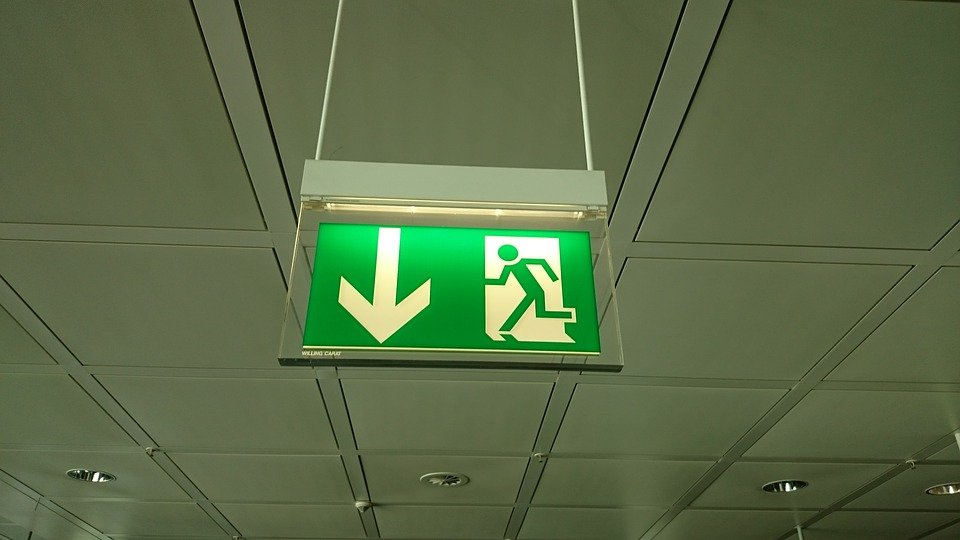

# Emergency exit recognizer

The purpose of the developed tool is to recognize the presence or the absence of emergency exit shields inside a .png or .jpg picture and, in case of presence, to correctly identify the arrow within the shield and acustically signal the direction to follow to leave the building.
Since pure image processing and no Machine Learning techniques were used, the reconnaissance value is not optimal; at the actual state, the tool is able to recognize correctly the presence or absence in 70-75% of the images that were collected as samples. In the other 20-25% of sample images, false positive and false negative results may be returned.

### Technologies used: Python, OpenCV, tkinter library

